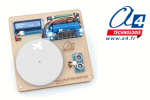

# a4-microsystem-shifumi



MakeCode extension for the **A4 Technologie microSySTEM-ShiFuMi** educational rock-paper-scissors model for **BBC micro:bit**.

The microSySTEM-ShiFuMi turns the familiar rock-paper-scissors game into an automated system. A BBC micro:bit reads the ultrasonic sensor, controls the disc servomotor, drives the RGB backlight located below the disc and displays information on the LCD screen.

## Product and educational use

The model is designed for technology and computer science education. It can be used to study:

- automated systems;
- information and energy chains;
- distance measurement with an ultrasonic sensor;
- servomotor positioning and calibration;
- RGB visual signalling;
- random values, variables and conditional programming;
- state-based control sequences;
- human-machine interaction through an LCD screen.

**Product page:**

https://www.a4.fr/shifumi-maquette-programmable-microsystem-pour-micro-bit.html

**Manufacturer:**

https://www.a4.fr

## Hardware

The microSySTEM-ShiFuMi model uses:

- **BBC micro:bit** – program execution and user interface;
- **DFR1216 expansion board** – connection and power interface;
- **micro-servomotor** – positions the rock-paper-scissors disc;
- **Grove ultrasonic sensor** – detects the player's hand;
- **RGB LED** – provides colored backlighting below the disc;
- **Grove LCD 16 × 2** – displays the game state and selected symbol.

### Connections used by the extension

| Component | Connection |
|---|---|
| Disc servomotor | S0 on the DFR1216 board |
| Ultrasonic sensor | P2 |
| Disc RGB backlight | P0 |
| Grove LCD | I2C – address `0x3E` |
| DFR1216 expansion board | I2C – address `0x33` |

## Add the extension in MakeCode

1. Open the [MakeCode editor for micro:bit](https://makecode.microbit.org/).
2. Create or open a project.
3. Select **Extensions**.
4. Paste the repository URL into the search field:

```text
https://github.com/A4-TECHNOLOGIE/a4-microSySTEM-ShiFuMi
```

5. Select the **A4 microSySTEM ShiFuMi** extension.

## Blocks / API

### Position the disc

```typescript
a4MicroSystemShiFuMi.setDiscServoAngle(90)
```

Sets the angle of the disc servomotor between `0°` and `180°`. The three useful angles depend on the mechanical assembly and can be calibrated in the student program.

### Measure the distance

```typescript
let distance = a4MicroSystemShiFuMi.ultrasonicDistanceCm()
```

Returns the distance measured by the ultrasonic sensor in centimetres. The function returns `-1` when no echo is received.

### Detect the player's hand

```typescript
if (a4MicroSystemShiFuMi.handDetected(12)) {
    basic.showIcon(IconNames.Yes)
}
```

Returns `true` when a hand or object is detected below the selected distance.

### Control the RGB backlight below the disc

```typescript
a4MicroSystemShiFuMi.setDiscBacklightBrightness(30)
a4MicroSystemShiFuMi.setDiscBacklightColor(
    a4MicroSystemShiFuMi.ShiFuMiColor.Blue
)
```

The disc backlight can be set to a predefined color, configured with custom RGB values or turned off.

### Display information on the LCD screen

```typescript
a4MicroSystemShiFuMi.lcdInit()
a4MicroSystemShiFuMi.lcdShowTextLine("SHIFUMI READY", 1)
a4MicroSystemShiFuMi.lcdShowNumberLine(0, 2)
```

The extension initializes the LCD automatically when a display block is used. Text is limited to 16 characters per line.

## Example: one automated round

The following example waits for the player's hand, runs a countdown, randomly selects one of the three symbols and waits until the hand is removed before starting a new round.

```typescript
let choice = 0

a4MicroSystemShiFuMi.setDiscBacklightBrightness(30)
a4MicroSystemShiFuMi.setDiscBacklightColor(
    a4MicroSystemShiFuMi.ShiFuMiColor.Blue
)
a4MicroSystemShiFuMi.lcdShowTextLine("SHIFUMI READY", 1)

basic.forever(function () {
    if (a4MicroSystemShiFuMi.handDetected(12)) {
        a4MicroSystemShiFuMi.setDiscBacklightColor(
            a4MicroSystemShiFuMi.ShiFuMiColor.Orange
        )

        for (let count = 3; count >= 1; count--) {
            a4MicroSystemShiFuMi.lcdShowNumberLine(count, 2)
            basic.pause(500)
        }

        choice = randint(0, 2)

        if (choice == 0) {
            a4MicroSystemShiFuMi.setDiscServoAngle(20)
            a4MicroSystemShiFuMi.lcdShowTextLine("ROCK", 2)
        } else if (choice == 1) {
            a4MicroSystemShiFuMi.setDiscServoAngle(90)
            a4MicroSystemShiFuMi.lcdShowTextLine("PAPER", 2)
        } else {
            a4MicroSystemShiFuMi.setDiscServoAngle(160)
            a4MicroSystemShiFuMi.lcdShowTextLine("SCISSORS", 2)
        }

        a4MicroSystemShiFuMi.setDiscBacklightColor(
            a4MicroSystemShiFuMi.ShiFuMiColor.Green
        )

        while (a4MicroSystemShiFuMi.handDetected(18)) {
            basic.pause(50)
        }

        a4MicroSystemShiFuMi.lcdShowTextLine("SHIFUMI READY", 1)
        a4MicroSystemShiFuMi.setDiscBacklightColor(
            a4MicroSystemShiFuMi.ShiFuMiColor.Blue
        )
    }

    basic.pause(50)
})
```

> Adjust the three servomotor angles to match the calibrated positions of your model.

## Artificial intelligence extension

The microSySTEM-ShiFuMi can also be associated with the **microSySTEM-AI Vision** model and its HuskyLens 2 camera. The camera can recognize the player's rock, paper or scissors gesture and transmit the result to another BBC micro:bit by radio. The program can then compare both choices, announce the winner and keep score.

More information and programming examples are available in the technical and educational documentation for the microSySTEM-AI Vision model.

## License

This extension is released under the **MIT License**. See [LICENSE.txt](LICENSE.txt).

## A4 Technologie

Designed for educational use by **A4 Technologie**.

https://www.a4.fr

---

for PXT/microbit
